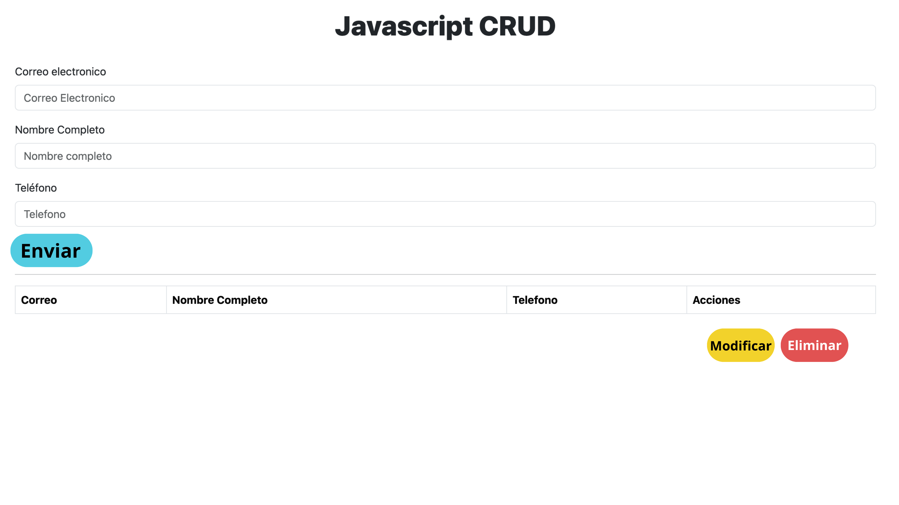

# PROYECTO 1: CRUD "Mono Porfiado Store"
## **INDICE**

*  Intro
*  Objetivos
*  Funcionaldades Específicas
*  Demo
*  Prototipado simple
  

## Intro
Este trabajo, corresponde a la segunda entrega de proyecto del Bootcamp de Desarrollador Web Full Stack de la UDD, se centra en el desarrollo de un sistema CRUD (Create, Read, Update, Delete) con el propósito de gestionar tareas. Este proyecto tiene como objetivo principal proporcionar una aplicación web interactiva que permita a los usuarios realizar operaciones fundamentales en la administración de tareas, como la creación, lectura, actualización y eliminación.

## Objetivos

El objetivo principal del proyecto es implementar un sistema CRUD completo que permita a los usuarios realizar acciones clave en la gestión de tareas. Se busca proporcionar una interfaz intuitiva y fácil de usar que permita a los usuarios interactuar eficientemente con la aplicación.

## Funcionalidades Específicas

- Crear Datos de Usuario:
Se pretende permitir a los usuarios agregar su email, telefono y nombre mediante un formulario que incluye campos específicos.
- Leer Datos de Usuario:
Los datos creadas se mostrarán de manera clara y organizada en la parte inferior de la aplicación, facilitando su lectura y visualización.
- Actualizar Datos de Usuario:
Se implementará la capacidad de editar los datos existentes, brindando a los usuarios la posibilidad de realizar modificaciones según sea necesario.
- Eliminar Datos de Usuario:
Los usuarios podrán eliminar sus datos seleccionados, ofreciendo una funcionalidad de eliminación para mantener la lista de usuarios actualizada.
Sección que involucra el logo y las áreas principales del sitio.

## Demo
Puedes acceder a mi trabajo aquí: https://renzofantu.github.io/Repositorio-2/#crud

## Prototipado simple

